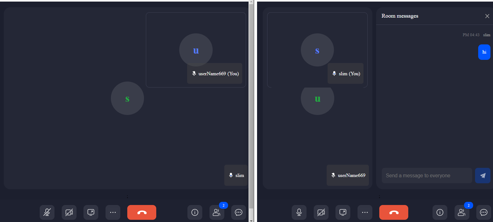

# VideoCall Web App with Spring Boot

Welcome to the VideoCall Web App, a powerful video call application built with Spring Boot, JavaScript, and ZegoCloud. This application empowers users to seamlessly create and join meetings, fostering collaboration with the added features of in-app chat and screen sharing.

## Screenshots:





## Features:

### 1. User Authentication
- Sign up and authenticate yourself on the app to access its powerful video call capabilities.

### 2. Create and Join Meetings
- Users have the freedom to create meetings and effortlessly connect with others.
  
### 3. Seamless Collaboration
- The application provides a platform for seamless collaboration through high-quality video calls.

### 4. In-App Chat
- Enhance communication with the in-app chat feature, allowing users to exchange messages during video calls.

### 5. Screen Sharing
- Share your screen during video calls to collaborate more effectively and showcase presentations.

## Technologies Used:

- **SpringBoot 3:** A powerful and flexible Java-based framework for building enterprise-level applications.

- **JavaScript:** Used for dynamic client-side functionality, enhancing the user experience.

- **ZegoCloud:** Leveraging ZegoCloud for video call functionalities, ensuring high-quality and reliable communication.

## Getting Started:

1. **Clone the Repository:**
   ```bash
   git clone https://github.com/slim20000/VideoCall-webApp-SpringBoot.git

## Run the Application:

1. Set up your Spring Boot development environment and run the application.

## Access the App:

2. Open your web browser and navigate to [http://localhost:6152](http://localhost:8080) to access the VideoCall Web App.

## How to Use:

### Sign Up:

1. Create a new account or log in if you are an existing user.

### Create a Meeting:

2. Use the app interface to create a new meeting.

### Join a Meeting:

3. Enter the meeting ID to join an existing meeting.

### Collaborate:

4. Enjoy high-quality video calls with in-app chat and screen sharing capabilities.

## Technologies:

- Spring Boot
- JavaScript
- ZegoCloud

